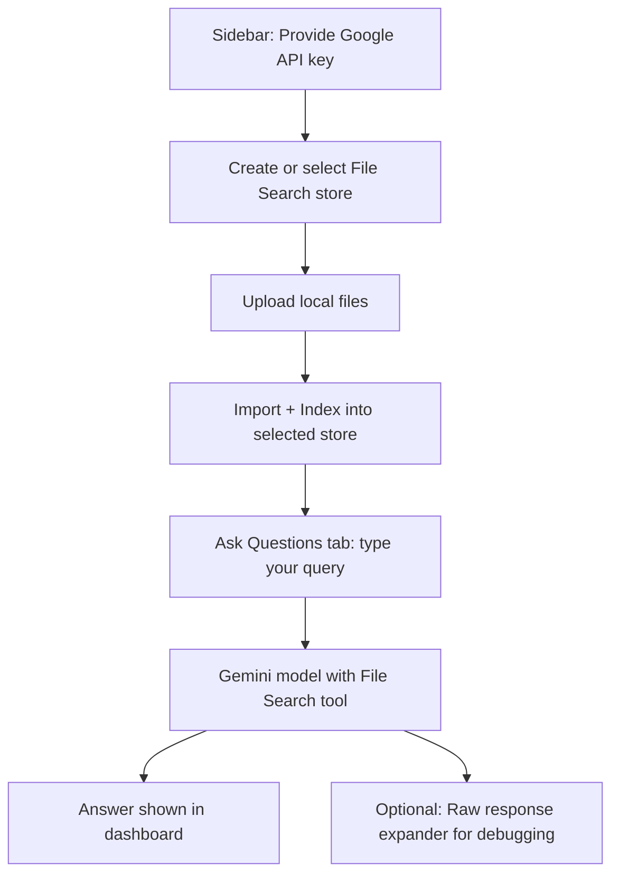

# Gemini File Search Dashboard

A minimal dashboard for creating and managing Gemini File Search stores, uploading and indexing local files, and asking questions with RAG-style context from those files.

## Features
- Create and select File Search stores
- List, refresh, and delete indexed documents
- Upload files and import them into a store (single-step upload-and-index)
- Ask questions with Gemini using File Search as context
- Optional “Raw response” expander for debugging responses
- Network request logging suppression to keep terminal output clean

## Minimal workflow

## How it works
- You provide a Google API key in the sidebar.
- Create or select a File Search store.
- Upload files; each file is imported directly into the selected store.
- Ask questions; the app calls Gemini with a File Search tool configured to your active store.
- Answers combine model reasoning with retrieved context from your indexed files.

## Hosted sample app
A sample app is hosted at https://simple-gemini-rag.streamlit.app/

## Local setup
1. Clone or open this project directory.
2. Ensure uv is installed.
   - Create a virtual environment: `uv venv`
   - Activate it: `source .venv/bin/activate`
3. Install dependencies:
   - `uv pip install -r requirements.txt`
4. Provide your Google API key in the app’s sidebar input when it launches.
5. Run the app:
   - `uv run -m streamlit run app.py`

## Usage
1. In the sidebar “Setup,” provide your Google API key.
2. Create or select a File Search store (the active store is shown at the top of the Upload tab).
3. Upload files in “Upload & Index.” The app uploads and imports them into the active store.
4. Use “Ask Questions” to query the indexed content. The File Search tool is automatically configured to use your active store.

## System prompt (bug bounty context)
- The app currently includes a default, hardcoded system prompt oriented toward bug bounty program discovery.
- You can disable this by unchecking “Use default system prompt” in the Ask tab.
- For data sources, you can use files from the bounty-targets-data repository to ground your queries (e.g., `domains.txt`, `wildcards.txt`, JSON data exports). See: https://github.com/arkadiyt/bounty-targets-data/

## Data sources
- Prepare text or structured files locally (txt, md, csv, json, pdf, etc.).
- Upload them to your selected store.
- Ask targeted questions referencing the uploaded datasets.